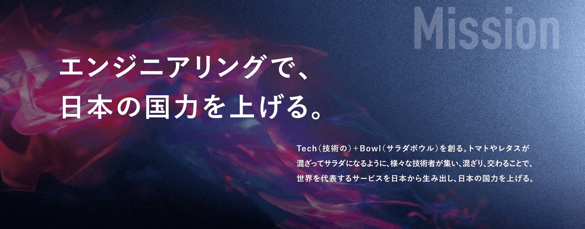

<!-- _class: title -->
# オーナーになろう

@sugit

---

<!-- _class: subtitle puru salute -->
# こんにちは

---

# 自己紹介

sugit(すぎっと) / X:@sugitlab

- モットー
    - 常にワクワクする仕事をすること
- インターネット上
    - Flutterの人、で通じることの方が多い
- やってきたこと
    - 研究、エンジニア、PM、技術営業、マーケ、経営(New)
- 社歴
    - 島津製作所 (R&D Mgr) → TechBowl (6人目社員)

株式会社TechBowl 取締役COO/CPO

---

# 会社紹介

### 株式会社TechBowl

---

# サービス紹介

### TechTrain - テクノロジーを支える、全ての人のターミナルに。

---

# お友だち紹介

### PullRequestの様に、エンジニアのコミュニケーションの中心になる存在をめざして。

---

<!-- _class: subtitle -->

# いきなりですが、 結論ファーストでいきます！

---

<!-- _class: subtitle -->
# 「オーナーになる」が PMキャリアを伸ばす秘訣です

---

# オーナーになるってどういうこと？
## PMのキャリアはこの順番

1. 機能のオーナーになる
1. プロジェクトのオーナーになる
1. プロダクトのオーナーになる
1. マルチプロダクトのオーナーになる
1. 組織のオーナーになる

---

# 前提
## 順番は前後してもいい

### スモールチームで "プロダクトのオーナー" をやっていた人が、大きな組織で "プロジェクトのオーナー" をやるなど

## Very Good です 👍

---

# オーナーになる、とは?

自分でそれを「売れる」こと 

---

# オーナーになる、とは?
## 売れる

- 機能を顧客に説明し「欲しい、買いたい」と言ってもらえること
- プロジェクト、プロダクト等も同様

---
# オーナーになる、とは?
## 売れるようになるには

- 売る相手のことをわかっている
- 売るロジックをわかっている
- 作り方をわかっている
- 売ったあとの未来が見えている

