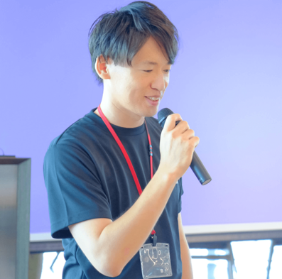
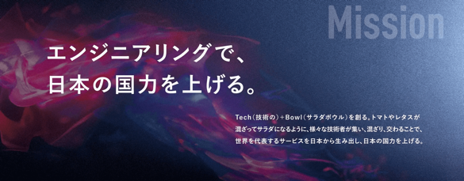
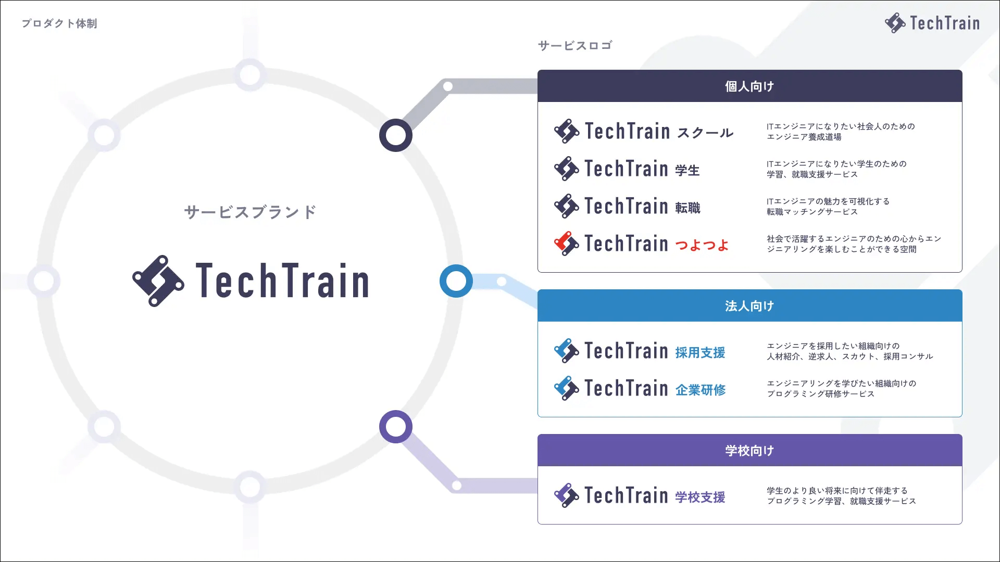
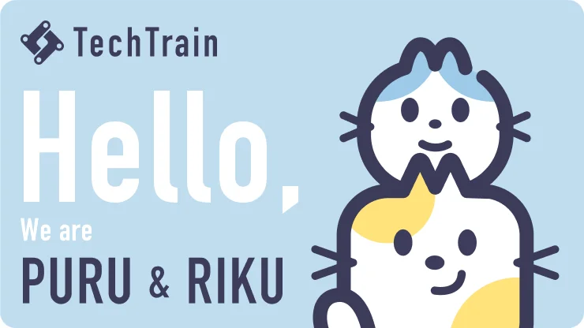

<!-- _class: title -->
# PMはいいぞ

@sugit

---

<!-- _class: subtitle puru salute -->
# こんにちは

---

# 自己紹介

sugit(すぎっと) / X:@sugitlab

- モットー
    - 常にワクワクする仕事をすること
- インターネット上
    - Flutterの人、で通じることの方が多い
- やってきたこと
    - 研究、エンジニア、PM、技術営業、マーケ、経営(New)
- 社歴
    - 島津製作所 (R&D Mgr) → TechBowl (6人目社員)

株式会社TechBowl 取締役COO/CPO

---

# 会社紹介

### 株式会社TechBowl

---

# サービス紹介

### TechTrain - テクノロジーを支える、全ての人のターミナルに。

---

# お友だち紹介

### PullRequestの様に、エンジニアのコミュニケーションの中心になる存在をめざして。

---

<!-- _class: subtitle riku smile -->
# はじめに、提案です

---

<!-- _class: subtitle riku happy -->
# PMになりませんか？

---

# 現代のビジネス環境とPMの需要
## PM、足りない問題

- PMが圧倒的に足りない時代に突入（特にIT業界）
  - 各社からのPM人材ニーズが高まっている
  - 採用面でも研修面でも、PMが足りないという声を、日々聞いています
- AIの進歩による職種の変化
  - 高度に抽象化・パターン化された業務はAIの得意領域になる
  - 学びのハードルが劇的に下がっている

---

<!-- _class: subtitle -->

# 職種の境界がどんどん曖昧になり、  混ざり合う時代

---

# クロススキルの時代
## 職種を超えたスキルの融合が進む

- まさに **CrossRel**
- 変化しつづける人材になろう

---

<!-- _class: subtitle puru think -->
# PMって何だろう？

---

# ちょっと違和感
## よく見かける設定

- 「PMは意思決定をするのが仕事です」
  → なんかエラソーじゃないですか？

- 「PMは折衝や調整をするのが仕事です」
  → なんかつまんなそうじゃないですか？

**PMはもっと楽しい仕事です！**

---

<!-- _class: subtitle puru peek -->
# 私なりに定義してみました

---

<!-- _class: subtitle -->
# 「みんなの意思決定を 事業成長に収束させること」

---

<!-- _class: subtitle riku smile -->
# この考えに至った背景

---

# 前職での経験

- 品質第一の業界
  - ソフトウェアのミスで誰かの人生を狂わせるリスクがある
    - 絶対に間違えてはいけない
  - 品質 = ソフトウェア品質の高さ + 説得力 + 信頼性
- 品質に対する説得力と信頼性とは？
  - 最終成果物であるソフトウェアだけではない
  - 法規制への適切な対応など、開発プロセスから要求が入る
- 結論
  - **開発の過程すらもプロダクトの一部** である

---

# 前職での経験（続き）

- 徹底的に設計と仕様を組み立てる
  - 実装工程は全体の3〜5割程度
  - 数十の部門が関わる複雑なコミュニケーション
- 組織内での信頼獲得
  - 「sugitが言ってるならそうなんだろう」と言われる存在になる
  - 各部門から頼られるポジショニング

---

# 前職での経験（続き）

どうやって信頼を獲得したか？

- 徹底的に **組織理解** を深める
- **各部門のGainとPainを知る** ために走り回る
- ボタンの掛け違えを見つけ、解消する

→ 「sugitがPMをしたプロジェクトは絶対に遅延しない」という評判を獲得

---

# そして転職へ

- コンフォートゾーンからの脱出
  - 残業禁止の会社で8時間戦っても、脳のリソースが余る
  - 副業をしてもコンフォートゾーン感は抜けない
- スタートアップへの転職（6人目の社員）
  - 良い意味で、頭が痛い仕事がしたい

---

# 現職 (TechBowl) での最初のアクション
##  組織を知る

- 誰が何を考え、求めて動いているのかを把握
- 関係性を図解し、頭に叩き込む
- 結果
  - 「BizDevコミュニケーションはsugitを必ず通す」という社内ルールができた
  - ※現在は解放されています

---

<!-- _class: subtitle puru salute -->
# これらの共通点

---

# 共通点
## 組織を知ることの重要性

- 品質第一の業界: 徹底的に考えてから作る
- スピード第一の業界: 作りながら考える業界

どちらも **「組織を知る」** ことでキャリアが開けた

---

# はじめの話題に戻りましょう
## 「みんなの意思決定を事業成長に収束させること」

これを実現するには
- みんなの **意思決定の背景** を理解する
- みんな何を考えて仕事をしているのかを知る
- みんなのGainとPainを知る

---

# PMになるには
## 組織を知る活動をすると...

- 大量の情報のインプットシャワーを浴びることになる
  - これを気持ちいいと言う覚悟で、受け止め、吸収する
- 組織を知る努力をすると、各部門のメンバーとして動けるスキルが身につく
  - スキルはあとから付いてくる。不思議。

---

# まとめると...
## 「みんなの意思決定を事業成長に収束させること」とは？

1. みんなの意思決定のGainとPainを意識する
1. 事業の向かう方向に沿ってみんなの視点を少しだけずらしてみる

---

<!-- _class: subtitle riku happy -->
# PMって楽しそうですよね？

---

# 結論
## PMの魅力

- PMはさまざまな職種のまんなかで走り回る仕事
- いまの仕事が武器になるので、誰でもチャレンジできる仕事
- AIの時代だからこそ、これまで以上に必要とされるスキル

---

<!-- _class: subtitle pururiku peek -->
# さぁ、PMになろう！

---

<!-- _class: subtitle pururiku bow -->
# ご清聴ありがとうございました
