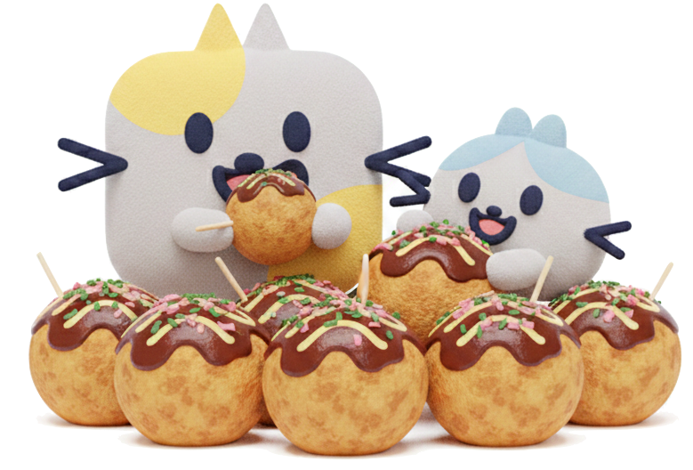

<!-- _class: title -->
## プロダクトにAIを。確率的なふるまいと向き合おう。

PM Kansai Meetup #1 | 2026-01-22

@sugit

---

<!-- class: body -->

sugit(すぎっと)
X: @sugitlab

## ものづくりが好きな人

- 現在
  - 株式会社 TechBowl 取締役COO/CPO
- やったことがある
  - 研究、エンジニア、PM、技術営業、マーケ、経営
- PM歴
  - 10年くらいやっているが、常に何かを兼務している
- 好き
  - アプリ作り、FlutterとC#、分割キーボード、工作・農作

---

# お友だち紹介

プルとリクです。よろしくね。

---

<!-- _class: service -->

---

<!-- _class: body puru salute -->

# 会場のみなさんに質問です！

---

# 🙋 AI使ってますか?

---

# 🙋‍♂️ AI機能の開発してますか?

---

<!-- _class: body riku peek -->

# 私の経験

---

### TechTrain Learning Agent
- エディタに常駐するLLMベースのAIメンター
- ユーザーの学習をリアルタイムでサポート

### 生化学データ分析（前職）
- CNNを使った信号解析
- 化学物質のイオンを電気信号に変換して測定する仕組み

→ **苦労したことを思い出しながら** 整理してみます

---

<!-- _class: cover -->

# 確率的なふるまいに向き合う

---

## いわゆる普通のシステムって、<strong class="red">決定論</strong> 的に動きます

- Aと入力すれば、いつだってBと答えてくれる。
- 条件分岐で表現されるので、条件網羅できる。テストしやすい。
- こんな画面になっててー、という結果から、何が起きたのか大体わかる。

---

## AIとか、機械学習を使うと、<strong class="blue">確率論</strong>的に動きます

- Aと入力しているけど、答えが毎回違う
- 条件というものがはっきりしない。テスト・・・どうしよう
- こんな画面になっててー、という結果から、何が起きたのかわからない時がある。

---

ねぇねぇ、そもそもさ、<strong class="blue">確率論と決定論</strong>ってよくわかんないんだけど

そうだよね、じゃあ具体例を考えてみよっか

---
<!-- _class: body puru salute -->

# 身近な例で考えてみます

---

### チャットボット
- 「こんにちは」→ 毎回違う返答（**確率的**）
- 詳しくはこちらボタン → 画面遷移（**決定論的**）

### レコメンド機能
- おすすめ商品の選定（**確率的**）
- 商品詳細ページへの遷移（**決定論的**）

---

レコメンドとかだと、確率論的におすすめ選定して、そのあとは決定論的にうごくってこと？

そうそう、つまり、  システムの中に<strong class="red">確率論的なパーツが混ざってる</strong> んだね！

なにそれ... 意味わかんないよ

---

たとえばレコメンドだと...

---

<!-- _class: body riku wonder -->
# 確率論的だと、どう困るんだろう？

---

## 1. 要件定義に困る

- YES/NO で書きづらく、正解の定義が難しい
- 期待する挙動をどう説明したら良いのだろう

---

## 2. チームで認識が揃わなくて困る

- PM 「ユーザー体験として、これくらいならOKかな」
- Eng 「技術的にはこのレベルなら出せるかな」
- QA 「これは不具合? 仕様? 判断できない...」

---

## 3. トラブルへの備えがわからなくて困る

- こういう結果が出てるんですが、あってるんですか？
  - あってる... はずなんだけどどうだろう？
- この前まではこんな結果でなかったんだけどどうなってるの？
  - なんでだろ... モデル変えたから?

---

## 1. 要件定義に困る
## 2. チームで認識が揃わなくて困る
## 3. トラブルへの備えがわからなくて困る

---

これは私の経験とお気持ちですが、、、

## 確率的な挙動に向き合うプロジェクトって、   <strong class="red">めちゃくちゃ難しい</strong>

- 機械学習を扱うプロジェクトってずっとこの難しさがあった
- モデルの性能が向上していますが、この難しさは続きそうだなぁと思っています。

---

# それでは、テーマ回収

---

<strong>「AI時代のプロダクトマネージャーの仕事」</strong>

## AI時代のプロダクトマネージャーは   <strong class="red">確率的なふるまい</strong> に立ち向かわなければいけない

---

<!-- _class: body puru salute -->

# 私なりにどう向き合っているか

---

- 確率論の前後はなるべく決定論で挟む
- 挟むのが難しい場合は人の目を入れる。Human in the loop。
- 評価関数的な考え方(YES/NOではない)を持ち込む
- 丁寧にログを設計する
- 評価(テスト)のOpsを頑張る

---

## ① 確率論の前後はなるべく決定論で挟む

### 考え方
- LLMの出力は揺れる前提で設計する
- 入力と出力に「枠」を作ることで体験のブレを抑える

### 具体的にやっていること
- 入力側: （例）ユーザー入力を構造化してからLLMに渡す
- 出力側: （例）NGワードフィルタ、フォーマット強制、選択肢化

### 効果
- （例）「想定外の回答」が出てもユーザー体験の最低ラインを守れる

---

## ② Human in the loop

### 考え方
- 完全自動化にこだわらない
- 「人が確認する」ステップを恥ずかしがらずに入れる

### 具体的にやっていること
- （例）重要な判断はAI提案 → 人が承認のフロー
- （例）定期的にサンプル抽出してレビュー

### 効果
- （例）致命的なミスを防げる、ユーザーからの信頼維持

---

## ③ 評価関数的な考え方を持ち込む

### 考え方
- YES/NOではなく「どれくらい良いか」で評価する
- 100点を目指さず、許容ラインを決める

### 具体的にやっていること
- （例）「10回中8回OKならリリース可」というルール
- （例）Good / Acceptable / NG の3段階で分類

### 効果
- （例）チームで「これはOK」「これはNG」の認識が揃う

---

## ④ 丁寧にログを設計する

### 考え方
- 何が起きたか後から追えるようにしておく
- 「説明責任」を果たすための布石

### 具体的にやっていること
- （例）入力・出力・モデルバージョン・タイムスタンプを記録
- （例）ユーザーのフィードバック（👍👎）も紐づける

### 効果
- （例）「最近おかしい」の原因特定が早くなる
- （例）改善のためのデータが溜まる

---

## ⑤ 評価(テスト)のOpsを頑張る

### 考え方
- 一度テストして終わりではなく、継続的に品質を見る
- 「いつの間にか劣化」を防ぐ

### 具体的にやっていること
- （例）週次で N件のサンプルを人手評価
- （例）モデル更新時は必ずA/B比較

### 効果
- （例）品質の変化を数値で検知できる
- （例）「体感」ではなく「データ」で議論できる

---

いずれにしても、<strong class="red">説明責任</strong>が取れるように設計することが大事

---

<!-- _class: body pururiku bow -->

# まとめ

- 確率的なふるまいに向き合う力をつけよう
- 戦い方はある、知見が足りない
- 戦う同志、求ム

---

<!-- _class: service -->

---

## ありがとうございました

