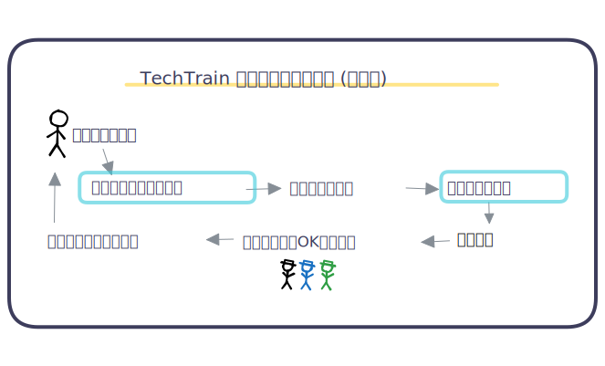

<!-- _class: title -->
## プロダクトにAIを。 確率的なふるまいと向き合う。

PM Kansai Meetup #1 | 2026-01-22

@sugit

---

<!-- class: body -->

## sugit（すぎっと）

- X(Twitter): **@sugitlab**
- TechBowl 取締役COO/CPO
- PM/Eng/研究/技術営業/マーケ/経営 (雑食)
- 滋賀在住のフルリモPM

---

# お友だち紹介

プルとリクです。よろしくね。

---

<!-- _class: body puru salute -->

# 会場のみなさんに質問です

- AIを使ってますか？
- AI機能を開発してますか？

---

## 普通の機能とAI機能って、考えることがちょっと違うんですよね。

### というのが、今日のメインテーマです。

---

## いつもの機能（決定論）

- 入力A → 出力B（いつも同じ）
- 仕様をifで書ける
- 再現できるので、切り分けとテストが楽

## AI機能（確率的）

- 入力A → 出力が揺れる（同じにならないことがある）
- 仕様が「条件」じゃなくて「許容ライン」になる
- 再現しづらいので、「説明できるか」が設計課題になる

---

<!-- _class: body riku peek -->

確率的って、どこがそんなに厄介なの？

AIが入ると、要件・QA・運用がまとめて変わるよ

---

たとえば、

### チャットボット
- 「こんにちは」→ 返答が毎回少し違う（**確率的**）
- ボタンで画面遷移 → いつも同じ（**決定論**）

### レコメンド機能
- 「おすすめを選ぶ」：確率的
- 「詳細へ遷移する」：決定論

つまり、**システムの中に確率的なパーツが混ざってくる**。

---

レコメンド機能のイメージ

**確率的なパーツ** がシステムのどこに、どう入るかを認識する 

---

<!-- _class: body riku wonder -->

# 確率的だと、なにが困る？ を具体的に

---

## 困りごと① 要件定義が変わる

- YES/NOで書けない（正解が1つに決まらない）
- 「どのくらい良ければOK？」を言葉にしないとチームが動けない

PMとしてやること：
- 許容ライン / NG例 / 評価指標（スコア）をPRDに入れる

---

## 困りごと② 認識が揃わない

- PM「体験としてこのくらいならOK」
- Eng「技術的にはこのレベル」
- QA「不具合？仕様？判断できない」

PMとしてやること：
- OK/NGの“採点基準”を合意する（評価関数・チェックリスト）

---

## 困りごと③ トラブル時に説明できない

- 「この結果、あってる？」に即答できない
- 「前は違った」への切り分けが難しい

PMとしてやること：
- 説明責任のためのログと「あとから追える仕組み」を設計する

---

<!-- _class: cover -->

## **ここまでの結論**

AI機能を入れた瞬間、システムの一部が確率的になる。

だからPMは、仕様をYES/NOで書くだけでは足りない。

**評価・ガードレール・説明責任**を設計する。

---

<!-- _class: body riku peek -->

じゃあPMは、どう戦えばいいの？

戦い方はあるよ。5つに分けると整理しやすい

---

# 私なりの戦い方（5つ）

1. 確率的なパーツの前後を決定論で挟む（ガードレール）
2. Human in the loop（人の目を入れる）
3. 評価関数（YES/NOではなく点数）
4. 丁寧なログ設計（説明責任）
5. 評価（テスト）のOps（定期検査）

---

## ① ガードレール：前後を決定論で挟む

- 入力の構造化（フォーム/選択肢/制約）
- 禁止ワード・ポリシーフィルタ
- 出力フォーマット固定（JSON/テンプレ）
- フォールバック（ダメなら"わからない" or 既存導線へ）

狙い：**揺れても体験のボトムを守る**

---

## ② Human in the loop：最終防衛ライン

- 全自動が常に正義ではない
- リスク・コストが高い領域ほど、人の確認を設計で入れる

---

## ③ 評価関数：OK/NGを“点数”にする

- 100点を目指さず、許容ラインを決める
- チームで同じ物差しを持つ

10点満点のラフな評価シートを作っておくイメージ
- 例.
  - 検証セット20件で平均8.5点以上
  - 重大NG（安全性0点）が1件でも出たらリリース停止

---

## ④ ログ設計：説明責任のための最低限

- いつ・誰が・何を入れて・何が返って・なぜそうなったか

（例）
- 入力（匿名化）
- プロンプトのバージョン管理
- モデルなど主要パラメータ
- 参照データ（RAGの検索クエリ/上位ドキュメントIDなど）

前提、規約の設計も丁寧に。

---

## ⑤ 評価Ops：定期検査を運用に組み込む

- テスト用のデータをもっておく
- モデル更新・プロンプト更新・データ更新のたびに(自動)評価する体制
- 定期的に品質を観測し、変化に早く気づく

**完璧を求めず、継続評価で品質を保つ**

---

<!-- _class: body pururiku bow -->

# まとめ

---

<strong>「AI時代のプロダクトマネージャーの仕事」</strong>

## AI時代のプロダクトマネージャーは   <strong class="red">確率的なふるまい</strong> に立ち向かわなければいけない

- AI機能は“確率的なパーツ”をプロダクトに持ち込む
- PMは「評価・ガードレール・説明責任」を設計する

---

<!-- _class: service -->

---

<!--  _class: body  -->

## ありがとうございました

