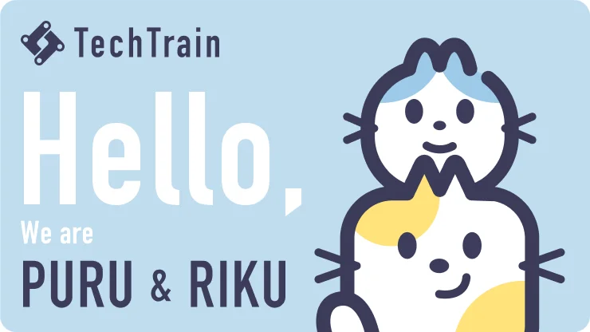

<!-- _class: title -->
# オーナーになろう
### 品質第一の業界とスピード第一の業界の経験から見えてきた、PMのキャリア

R35. Meetup in OKINAWA | 2025/3/21
@sugit

---

# 今日はロジカルにエモいことを話します

PMは翻訳家といわれたり、折衝が8割といわれることが多く、そのキャリアの築き方も、"思考法" で語られる節があります。

今日はそんな "お気持ち" をロジカルに組み立て、実践できるナレッジとして整理してみます。

---

<!-- _class: riku-ask -->
# 自らハードルを上げていくスタイル

---

# 自己紹介

sugit(すぎっと)

- 概要
    - Flutterの人、で通じることの方が多い
- モットー
    - 常にワクワクする仕事をすること
- やってきたこと
    - 研究、エンジニア、PM、技術営業、マーケ、経営(New)
- 社歴
    - 島津製作所 (R&D) → TechBowl

株式会社TechBowl 取締役COO/CPO

---

# 会社紹介

---

# サービス紹介

---

# お友だち紹介

---

# 品質第一の業界

- キャリアのスタートは医薬、ライフサイエンス系のR&D
- 厳しすぎる品質基準は開発プロセスをガチガチに締める
- それでいて、欧州米国が定める規格によって日々変わるプロセス
- 医院、製薬、官公庁の規定によって都度変わる要求仕様

アジャイル？毎日リリース？仕様書はソースコードです？

無理です。

---

# 1〜3年目

- 技術力は仕事をこなしつつ、個人で学べばそこそこなんとかなる
- 組織レベルで物事を見れる人にならないと役に立てないと気づく
- どうすればいい？

---

# 明日使えるナレッジその1

- 上長(自分の近くにいる、より責任の大きい人)の見ている視野を基準にする
- 組織・モノ・市場
    - まずは組織からがオススメ
    - 理由は単純、明日からはじめられるから

---

# 組織を把握する

- 自分を中心に、関わるヒトを少しづつ広げていく
- そのヒトたちのgainとpainを理解する
    - 観察する、話す
- ヒト、gain、painを大きな図解にする
- 各所でどんなパスが欲しいのかを理解する

---

# 組織を知ると、モノも市場も分かるようになる

- すべての人はモノや市場を見ながら働いている
- 役割によって捉え方が違う
- これを把握し、日常の業務に展開する
- そのあとはモノも市場もより大きな仕事がまわってくるようになる

→ あいつはわかっている、と認知されると、キャリアは急激に広がる

---

# 組織を知るコツ

- slackがあるなら、とりあえず全部のchに入る
    - 入って満足しない
    - 空気を読みつつ、会話を理解する、絵文字で反応する
    - 慣れてきたら『もしかしてコレ？』と助け舟を出してみる
    - ハマれば一勝
- 可能ならなるべく直接話す
    - 5分教えてとお願いする(マジで5分で終わらせる)
    - 聞くべきはHowやWhatではなく、GainとPain。
- ↑これを隙間時間でやる。必ず本来の業務は完遂する。本末転倒になると意味がない。

---

# 5〜9年目

hogehoge

---

# 構成メモ

- 結論
    - ヒト理解からキャリアを組み立ててみよう
- 経歴から
- 1〜5年
    - 院卒、現社長の誘いを断りR&Dの世界へw
    - 違法薬物、ドーピング、がん診断などに関わる
    - 生化学と数学とデータサイエンスの世界
    - クライアントがその道のプロばかり
    - 同じ土俵で議論できない開発者が多いと気づく
    - 高校生化学の本から医薬まで読み漁る
    - 話のわかるエンジニアとしてクライアントや営業から信頼
    - sugitが言ってるならそうなんだろう、というポジションを開発部門内で確立
    - 手戻りの多さに気づく
    - 全プロセスに関わる工程を知らない人が多い
    - 品質部門、製造工場、物流部門、サービスエンジニアまで、走り回って観察。仲良くなる。
    - 話のわかる開発部門の人として生産工程から信頼
    - sugitが言ってるならそうなんだろう、と言うポジションをさらに強化
    - 技術については仕事でもやりつつ個人でもやるスタイルで勝手にキャッチアップ
- 5〜9年
    - プロダクトに一番詳しい人→その界隈に一番詳しい開発の人→基幹システムのフルリプレイスのリーダーへ
    - メンバーのほとんどが年上、父親より歳上も、半数が海外、イギリス、インド、アメリカ...
- 10〜now
    - スタートアップ転職
    - 組織作りもやる、モノづくりもやる
    - まずはじめにやはりヒト
    - とにかく早く
    - 走りながら決めながら作る
    - Mgr→執行役員→取締役へと1年毎に役割が変わる
    - 組織を見る俯瞰から、社会・市場を見る俯瞰、未来を見据える俯瞰へ
- まとめると
    - どこまで自動化が進んでも、そこにいるヒトにはwillがあり、painがある
    - willとpainを理解し、プロセスを理解する
    - すべてのステークホルダーをごきげんに

