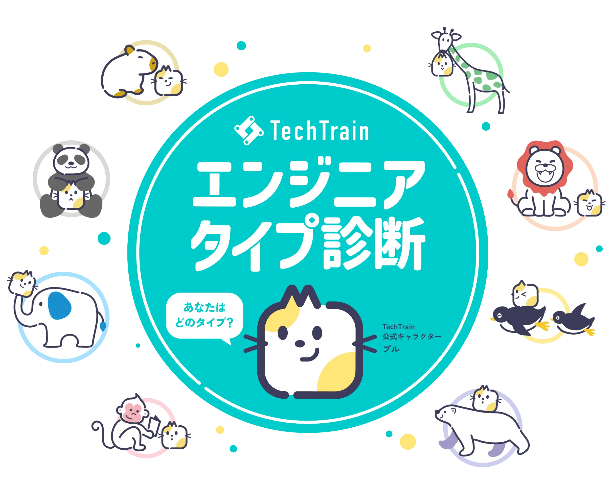
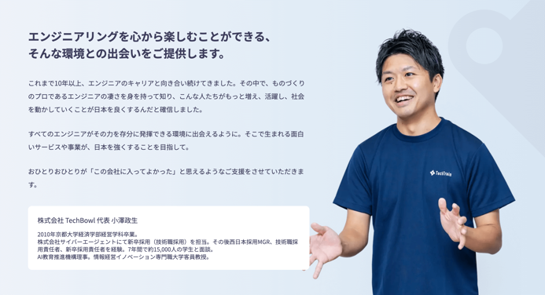

<!-- _class: title -->
# ヒトからはじめるモノづくり
### 品質第一の業界とスピード第一の業界の経験から見えてきた、PMのキャリア

R35. Meetup in OKINAWA | 2025/3/21
@sugit

---

<!-- _class: subtitle puru salute -->
# はいさーい

---

# 自己紹介

sugit(すぎっと) / X:@sugitlab

- モットー
    - 常にワクワクする仕事をすること
- インターネット上
    - Flutterの人、で通じることの方が多い
- やってきたこと
    - 研究、エンジニア、PM、技術営業、マーケ、経営(New)
- 社歴
    - 島津製作所 (R&D Mgr) → TechBowl (6人目社員)

株式会社TechBowl 取締役COO/CPO

---

# 会社紹介

### 株式会社TechBowl

---

# サービス紹介

### TechTrain - テクノロジーを支える、全ての人のターミナルに。

---

# お友だち紹介

### PullRequestの様に、エンジニアのコミュニケーションの中心になる存在をめざして。

---

# エンジニアタイプ診断
ぜひやってみてください

---

<!-- _class: subtitle riku smile -->
# キャリアの振り返りから

---

# 略歴

- 2012: インターンで現社長 (おざまさ) に出会う（内定辞退w）
- 2014: 新卒で島津製作所に入社
- 2021: TechBowlで副業開始 (技術メンター)
- 2023: 現職 (TechBowl) にPMとして転職
- 2024: 執行役員CPO
- 2025: 取締役COO/CPO

シンプルなキャリアだなぁ

---

# This is おざまさ

---

# 略歴から話題をピックアップ
## このあたりの話をします

1. 前職と現職の違い
1. 転職した背景
1. これからどうしたいか

よくある話だね

---

<!-- _class: subtitle puru one -->

# 1. 前職と現職の違い

---

# 1. 前職と現職の違い
## 前職: 品質第一

- 品質とは？
  - 品質第一の業界
    - ソフトウェアのミスで誰かの人生を狂わせるリスクがある
    - 絶対に間違えてはいけない
  - 品質 = ソフトウェア品質の高さ + 開発プロセスの品質の高さ
    - 最終成果物であるソフトウェアだけではない
    - 法規制への適切な対応など、開発プロセスから要求が入る
  - **開発の過程すらもプロダクトの一部** である

---

# 1. 前職と現職の違い
## 前職: 徹底的に考えてからつくる

- PoCレベルはすぐ作りますが、製品版の着手までにはかなりの手数があります
- PoC開発とドキュメント作成をなんどもなんども繰り返します
- 仕様・設計のレベルが一定基準に達すると、本格的な開発がスタートします
- 開発全体でみると、本実装が全体の30%くらいの工数です

---

# 1. 前職と現職の違い
## 現職: スピード第一

- **作りながら考える**
- インプットだけの時間はつくらない。アウトプットしながらインプットする。
- 考え込まない。2割当文化。
- 喋って解決する。バブバブ文化。
- 計画は柔軟に変える。

---

# 1. 前職と現職の違い
## 徹底的に考えてから作る / 作りながら考える

大事にしているポイントが異なれば、開発プロセスも大きく異なるんだね

どちらが優れているわけではなく、どちらも対応できるPMでありたいね

---

<!-- _class: subtitle puru two -->
# 2. 転職した背景

---

# 2. 転職した背景
## コンフォートゾーン問題×育児

- コンフォートゾーン
  - 仕事は楽しいが、どこか余裕がある。
  - 副業をしてみてもこの余裕は消えない。
  - 良い意味で頭を抱えながら仕事をしたかった。
  - そんなとき、昇進を打診される。大企業での昇進は、毎日出社、毎日残業への入り口。
- 育児
  - 次女が誕生
  - 家族で一緒に食卓を囲みたい

---

# 2. 転職した背景
## 育児もキャリアも諦めたくない

- フルリモで働ける
- 朝夕は育児ができる
- ワクワクする仕事で良い頭痛を
- **組織作りを経験したい** (← 突然登場)

現社長に相談したところ、まわりまわって一緒に働こうとなりました

---

# 2. 転職した背景
## why? 組織作り

- 前職では『sugitに頼んでおけばプロジェクトは予定通り完了する』という評判を獲得していました
- その背景にあるのが、**ヒトを知る** こと。
- ひとつのプロジェクトに数十の部門が関わり、海外販社もゾロゾロ出てくる
- 扱う製品のドメインは高度なサイエンスばかり
- 効率よく全部理解するには？本を読む？論文を読む？それでは遅かった
- **徹底的にヒトの理解に努めた**

---

# 2. 転職した背景
## モノづくりをするのは、ヒトの熱狂である

- 技術力を身に着けたり
- PMっぽいフレームワークに詳しくなったり
- マーケティングをかじってみたり
- それより先にすべきことは **「ヒトを知る」** ことだと思います

--- 

<!-- _class: subtitle riku salute -->
# タイトル回収！

---

<!-- _class: subtitle -->

「意思決定ができる」ではなく、 「みんなの意思決定を事業成長に収束させる」こと これこそがPMの真の役割だと思います

---

<!-- _class: subtitle -->
## このあたりの話はこちらの note に少しだけ書いています

---

<!-- _class: subtitle puru three -->
# 3. これからどうしたいか

---

# 3. これからどうしたいか
## まずは TechBowl を最高のチームにします

私が気に入っている弊社の文化です

- **2割当て** : 2割できたら見てもらってフィードバックを
- **バブバブ** : 言語化できずに悩むくらいなら10分話そう
- **オープン** : 事業の生々しい数字も、社員で共有しよう
- **ノビシロ** : あと一歩、突き刺したい案件を共有、全員の知恵を集結
- **ほめ** : 成果を讃える、いいことはみんなで共有
- **越境** : 商談にエンジニアが登場、仕様会議にCSが登場

---

# 3. これからどうしたいか (個人)
## "イケてるキャリア" より "ワクワクするキャリア" 

- 個人としてはキラキラとイケてるキャリアを歩む気はありません
- 常に **ワクワクしているか** にフォーカスします
- PMという職にこだわるつもりはありません。職種に縛られるのは好みません。
- こだわるのは、いくつになっても **ワクワクするものづくりをする** こと

一緒にワクワクしてくれる仲間とずっと仕事がしたいですね！

---

<!-- _class: subtitle -->

# つまり?

---

<!-- _class: subtitle puru happy -->

# ワクワクさん と 所ジョージさん   みたいになりたい

---

<!-- _class: subtitle pururiku bow -->
# ご清聴ありがとうございました
